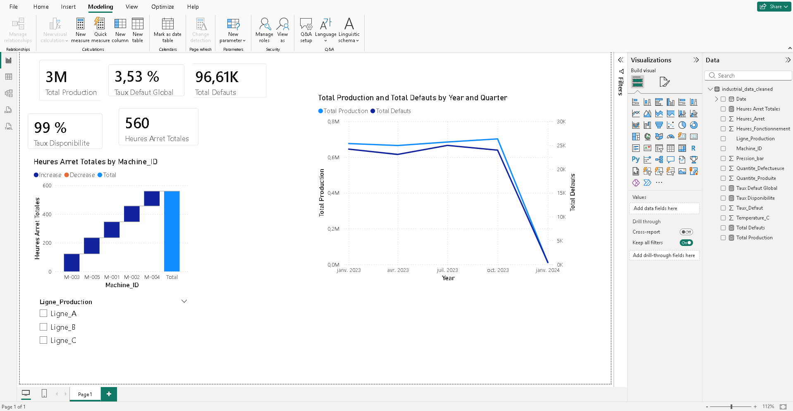
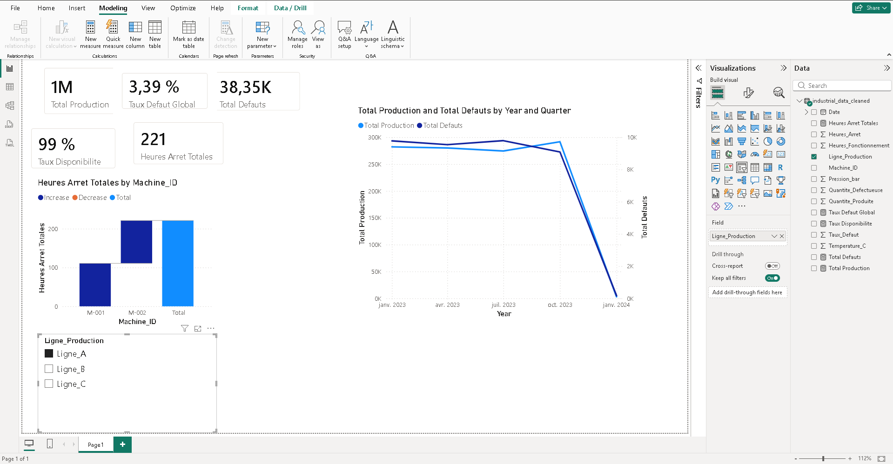
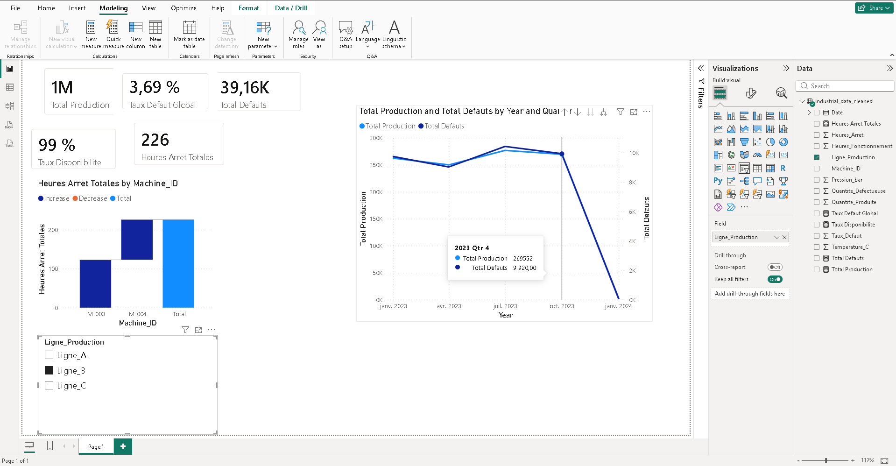
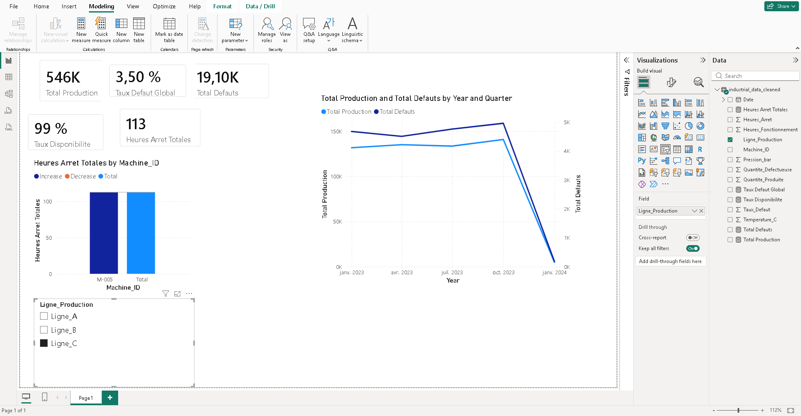

# Analyse de Donnees Industrielles : Suivi et Optimisation de Production

Ce depot presente un projet complet d'analyse de donnees simulant un cas pratique dans une usine industrielle. L'objectif est de comprendre les causes des arrets de machines, d'identifier les facteurs de defauts de production, et de creer un tableau de bord analytique pour la prise de decision.

## Contexte

Dans les usines manufacturieres, assurer la rentabilite implique de maintenir le temps de fonctionnement des machines (Uptime) au plus haut et de reduire le taux de rebuts (pieces defectueuses). Ce projet simule une enquete technique pour isoler les causes des pannes.

## Origine des donnees

Les donnees utilisees dans ce projet ont ete entierement generees de toutes pieces grace a un script Python developpe sur-mesure (`data_generator.py`). 
Ce script a cree plus de 5000 lignes simulant les erreurs classiques (anomalies de temperatures, donnees manquantes, etc.) produites par les capteurs d'une usine reelle. Cela permet de demontrer le travail concret de "Data Cleaning" exige en entreprise, sans utiliser de donnees confidentielles.

## Methodologie

Le projet a ete divise en plusieurs etapes analytiques :

1. Nettoyage de Donnees (Data Cleaning) : Utilisation de Pandas pour corriger les valeurs manquantes et traiter les erreurs aberrantes des capteurs.
2. Formules et Requetes : Emploi de sqlite3 pour interroger le dataset et identifier les machines subissant le plus d'arrets critiques.
3. Exploitation Visuelle : Export d'un fichier propre vers Power BI pour concevoir des indicateurs de performance clairs (KPI).

## Outils utilises

- Python (Pandas, Numpy) pour la generation et le nettoyage.
- SQL pour le questionnement de la base de donnees.
- Power BI (DAX) pour la conception du Dashboard final.

## Apercu du Dashboard Power BI

Le tableau de bord permet de visualiser rapidement les volumes de production, les taux de defauts et de localiser precisement les machines defectueuses.

Capture ecran 1

Capture ecran 2

Capture ecran 3

Capture ecran 4

